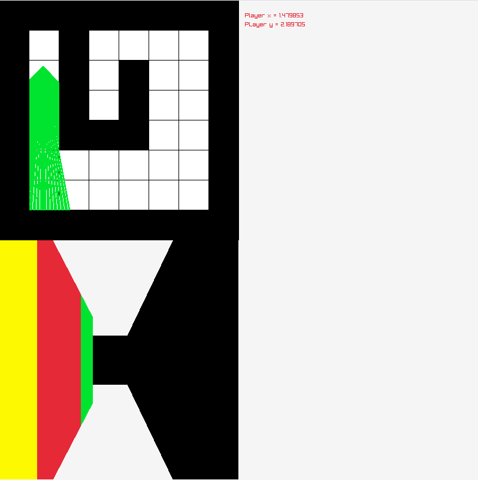

# Raycasting Engine

## Introduction

This project is a small raycasting engine made in C. It's still work in
progress but the rendrer part is already working.

## Build

### Dependencies

First you must have gcc, make and raylib installed in your system.

### Building the project

For building this project first clone this repo

`git clone git@github.com:Karilla/raycasting.git`

then go to the director with

`cd raycasting`

and finally you can build the project with the `make` command.

## Command

w - Moving forward

S - Moving backward

A - Rotating left

D - Rotating right

## Screenshot

